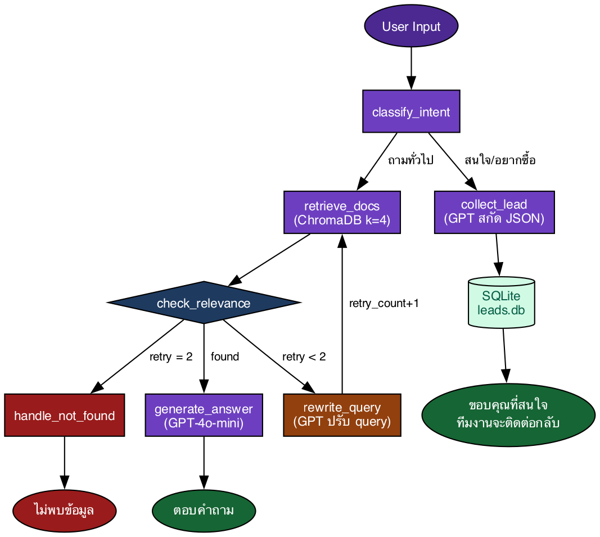

# InsureX AI Sales Assistant
### Advanced RAG System with LangGraph

ระบบผู้ช่วยพนักงานขายประกัน สำหรับ InsureX โดยใช้ Retrieval-Augmented Generation (RAG) และ LangGraph workflow orchestration

---

## Features

**Core Requirements**
- RAG จากข้อมูลผลิตภัณฑ์ประกัน InsureX จริง (5 หมวด)
- LangGraph StateGraph พร้อม conditional routing และ retry cycle
- ChromaDB vector database + OpenAI embeddings
- Error handling เมื่อไม่พบข้อมูล
- ตรวจจับความสนใจซื้ออัตโนมัติจาก keyword
- GPT สกัดข้อมูลลูกค้า (ชื่อ / อาชีพ / รายได้ / เบอร์โทร)
- บันทึกลง SQLite พร้อมแสดงใน sidebar แบบ realtime
- แต่ละ user ได้ session_id (UUID) ต่างกัน
- ประวัติการสนทนาแยกอิสระต่อ session
- ล้าง session และเริ่มใหม่ได้ทันที

---

## Architecture



**Stack**

| Layer | Technology |
|---|---|
| LLM | GPT-4o-mini (OpenAI) |
| Embeddings | text-embedding-3-small |
| Vector DB | ChromaDB |
| Orchestration | LangGraph (StateGraph) |
| Framework | LangChain |
| UI | Streamlit |
| Lead Storage | SQLite |
| PDF Parsing | PyPDF |

---

## Project Structure

```
insurex_rag/
├── create_pdfs.py        # Scrape InsureX API → สร้าง PDF 5 ไฟล์
├── main.py               # Streamlit UI
├── requirements.txt
├── src/
│   ├── models.py         # AgentState, LeadInfo (Pydantic)
│   ├── ingestion.py      # Load PDF → ChromaDB vectorstore
│   ├── nodes.py          # LangGraph node functions
│   ├── graph.py          # StateGraph wiring
│   ├── tools.py          # SQLite CRUD (init_db, save_lead, get_all_leads)
│   └── session.py        # In-memory session management
├── data/
│   └── pdfs/             # PDF ข้อมูลผลิตภัณฑ์ 5 ไฟล์
└── vectorstore/          # ChromaDB persist directory (auto-generated)
```

---

## Setup

### Prerequisites
- Python 3.11+
- OpenAI API Key

### 1. Clone และสร้าง environment

```bash
git clone https://github.com/praewery/insurex-rag.git
cd insurex-rag
conda create -n insurex_rag python=3.11
conda activate insurex_rag
pip install -r requirements.txt
```

### 2. ตั้งค่า API Key

สร้างไฟล์ `.env` ใน root directory:

```
OPENAI_API_KEY=sk-...your-key-here...
```

### 3. Build Vectorstore

```bash
python src/ingestion.py
```

> PDF ข้อมูลผลิตภัณฑ์อยู่ใน `data/pdfs/` แล้ว ไม่ต้อง scrape ใหม่
> ถ้าต้องการ scrape ใหม่จาก InsureX API ให้รัน `python create_pdfs.py` ก่อน

### 4. รัน Application

```bash
streamlit run main.py
```

เปิด browser ที่ `http://localhost:8501`

---

## การใช้งาน

**ถามข้อมูลผลิตภัณฑ์**
```
ประกันสุขภาพมีอะไรบ้าง?
ประกันอุบัติเหตุ PA Plus คืออะไร?
ประกันชีวิตเหมาะกับใคร?
```

**แจ้งความสนใจซื้อ (Lead Collection)**
```
สนใจซื้อประกัน ชื่อมีนา อาชีพครู โทร 081-234-5678
อยากสมัครประกันสุขภาพ
```

---

## Data Sources

ข้อมูลผลิตภัณฑ์ดึงจาก [insurex.co.th](https://www.insurex.co.th) ครอบคลุม 5 หมวด:

| ไฟล์ | หมวด | ผลิตภัณฑ์ |
|---|---|---|
| `01_health.pdf` | ประกันสุขภาพ | Easy E-Health, E-Health Deduct, Health Mini, และอื่นๆ |
| `02_life.pdf` | ประกันชีวิต | Term, Whole Life 90/20, Whole Life 99/99, และอื่นๆ |
| `03_accident.pdf` | ประกันอุบัติเหตุ | PA Plus |
| `04_critical_illness.pdf` | ประกันโรคร้ายแรง | CI Plus, Cancer, CI50 |
| `05_savings.pdf` | ประกันสะสมทรัพย์ | Saving 189, Aomsook, และอื่นๆ |

---

## LangGraph Cycle (Retry Logic)

จุดเด่นของระบบคือ **retry loop** ใน LangGraph:

1. ค้น ChromaDB ครั้งแรก
2. `check_relevance` ตรวจว่า docs ที่ได้มีเนื้อหาจริงไหม
3. ถ้าไม่ดีพอ → `rewrite_query` ให้ GPT ปรับคำถามใหม่ → ค้นซ้ำ
4. ทำซ้ำได้สูงสุด **2 รอบ** ถ้ายังไม่เจอ → แจ้ง "ไม่พบข้อมูล"

```python
# graph.py
graph.add_conditional_edges(
    "retrieve_docs",
    check_relevance,
    {
        "generate":  "generate_answer",
        "rewrite":   "rewrite_query",    # ← cycle
        "not_found": "handle_not_found",
    }
)
graph.add_edge("rewrite_query", "retrieve_docs")  # ← วนกลับ
```

---

## Environment Variables

| Variable | Description |
|---|---|
| `OPENAI_API_KEY` | OpenAI API Key |

> ไม่ commit `.env` ขึ้น Git เด็ดขาด — ใส่ใน `.gitignore` แล้ว
